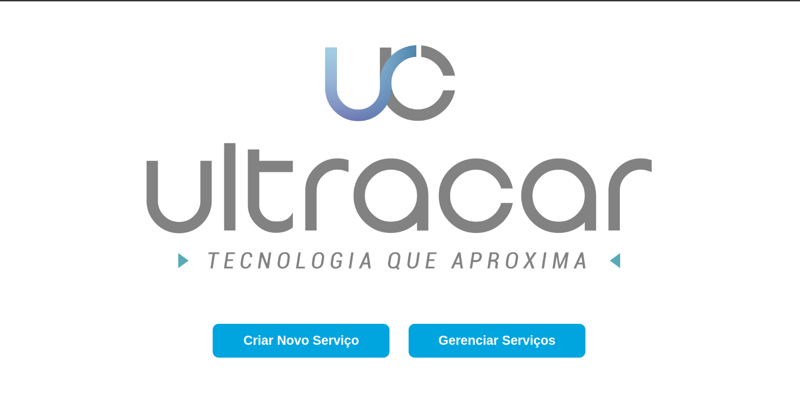
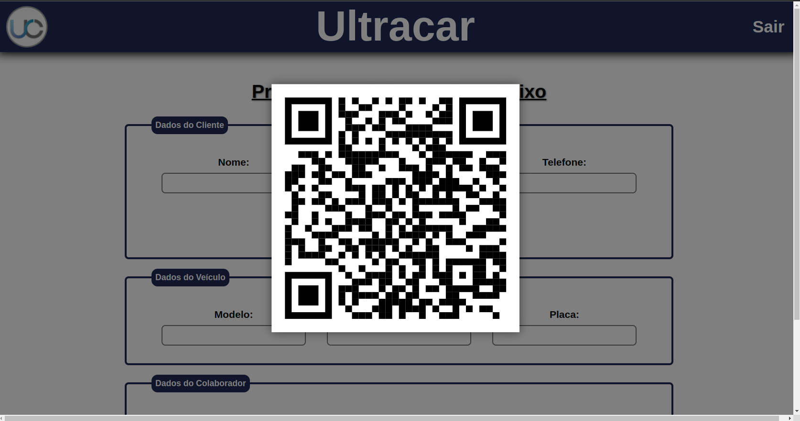
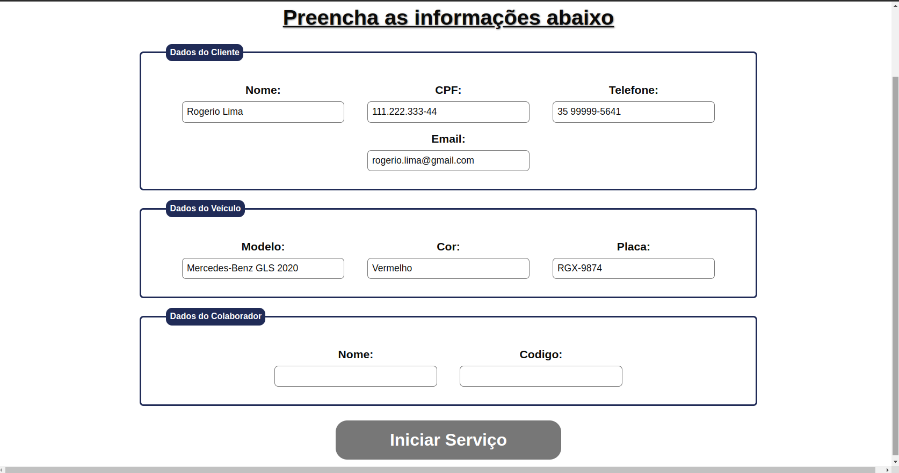
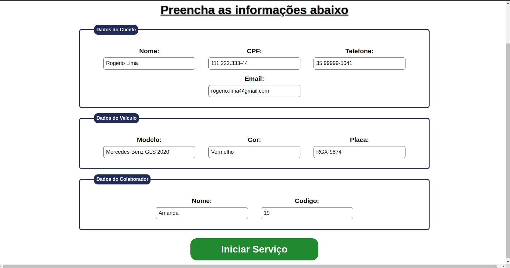
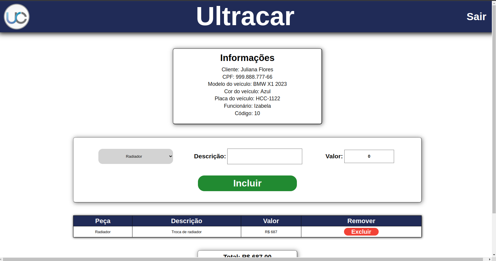
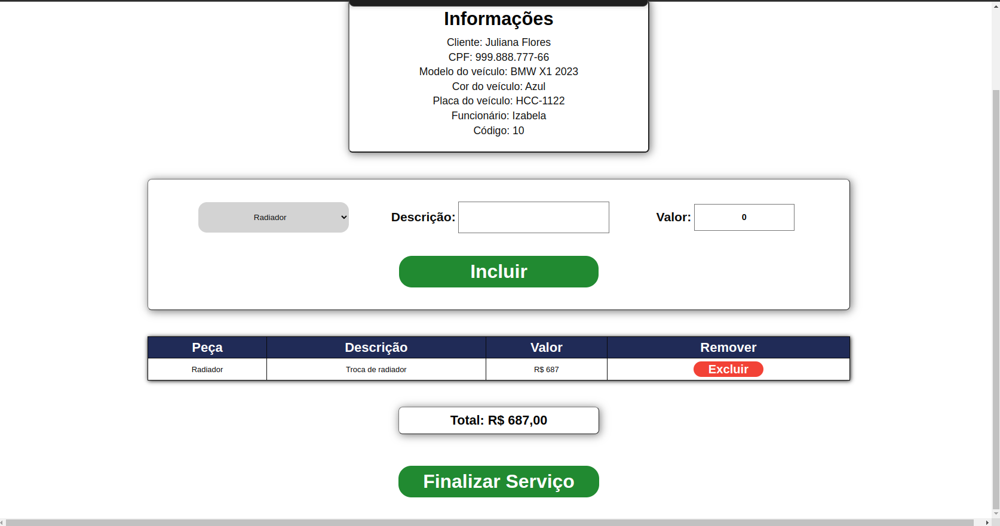
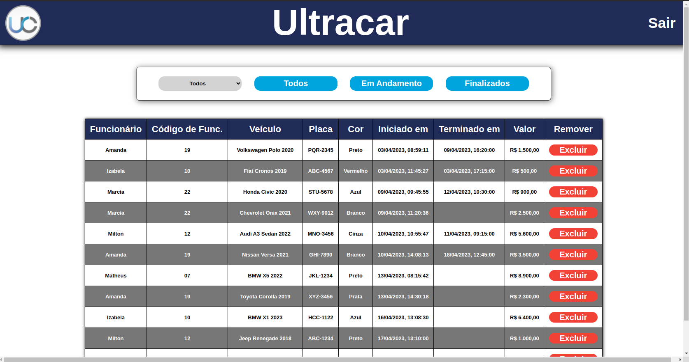

# Ultracar Front

- Consiste em um projeto de front feito em React, que basicamente simula uma aplicação que gerencia um ciclo de serviço de uma determinada oficina, e também gerencia todos os serviços registrados.

---

# Tecnologias utilizadas :books:

- Javascript, HTML, CSS, React, Docker, Docker-compose.

---

# Como Utilizar a aplicação

## Importante :warning:

- A aplicação tem boa parte de seu funcionamento mockado devido à falta da implementação do backend, algumas simulações são feitas pelo console.log, as funções que mostram a data que o serviço foi iniciado e finalizado aparecem no console ao clicar nos respectivos botões de "iniciar serviço" e "finalizar serviço.

  

    <strong>
      Rodando com o docker 
    </strong>
  
 

  - Comece clonando o repositório e acesse a pasta `/app`.
  - Ao acessar basta digitar no terminal o comando `docker-compose up -d` ou `docker-compose up` caso queira ver os logs.
  - Após isso é só acessar o endereço `http://localhost:3000/` e utilizar a aplicação.

  
<strong>Rodando sem o docker :wrench: </strong>
 

  - Comece clonando o repositório e acesse a pasta `/app/frontend`.
  - Ao acessar digite o comando `npm install` no terminal e aguarda a instalação das dependências.
  - Após instaladas basta digitar o comando `npm start` no terminal e aguardar a aplicação iniciar.
  - Após iniciada é só acessar o endereço `http://localhost:3000/` e utilizar a aplicação.

---

# Telas

- Abaixo estão as telas pedidas no desafio.

## Tela inicial

- Tela inicial contém dois botões com animações, um para criar um novo serviço e outro para gerenciar os serviços existentes.

## Tela de criação de serviço

- A tela ao ser aberta exibe um QRcode simulando uma ação do cliente ao ler o QRcode, logo após os dados do mesmo aparecem preenchidos, porém o botão de iniciar está desabilitado, ao preencher o nome do funcionário e o código do mesmo que realizará o serviço o botão é habilitado.

## Tela de finalização do serviço

- A tela exibe um pequeno menu onde aparece as informações do cliente e do veículo além das do funcionário encarregado pelo serviço, logo abaixo uma caixa para adicionar a peça que foi usada, uma descrição do trabalho realizado e o valor além do botão para incluir a tarefa realizada, e mais abaixo está presente uma tabela em que aparecem todos as tarefas realizadas no veículo descritas e com um botão para caso seja necessário remover alguma, abaixo da tabela possui o total da soma das peças usadas e logo abaixo o botão para finalizar o serviço, ao finalizar o usuário é redirecionado para a página inicial.

## Tela de gerenciamento de serviços

- A tela exibe primeiramente uma caixa com botões de filtro em que é possível filtrar os serviços que estão listados na tabela abaixo da caixa de filtros, é possível filtrar por nome dos funcionários, por todos, por serviços que estão em andamento e por serviços já finalizados.

---

- Desenvolvido por [Matheus Marinho](https://www.linkedin.com/in/matheus-marinhodsp/).